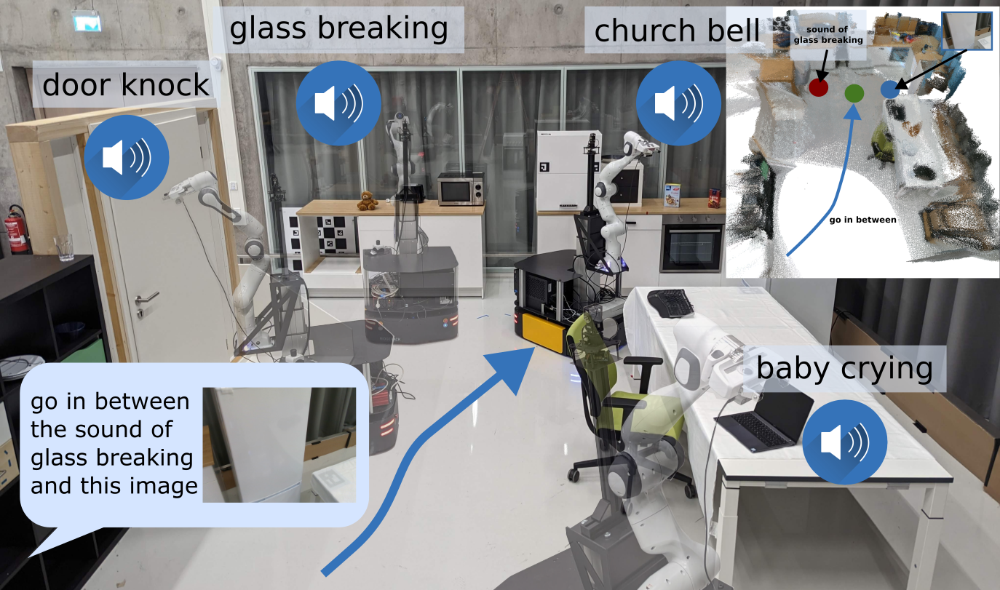
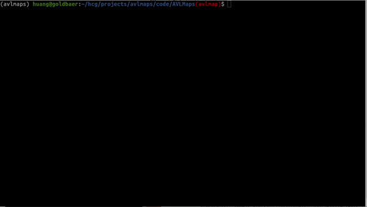
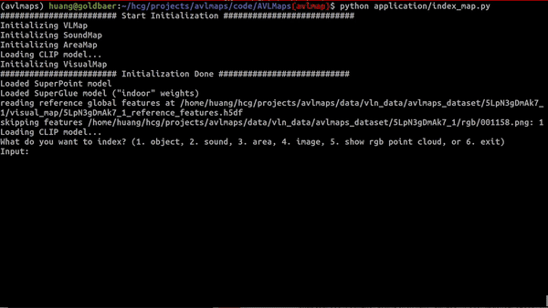
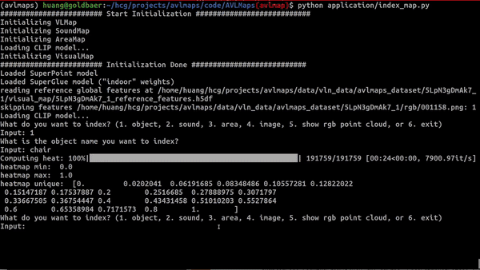
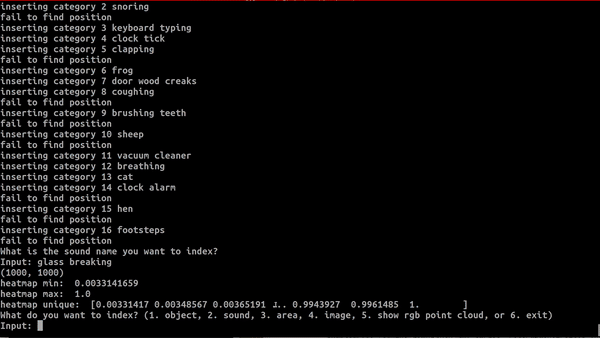
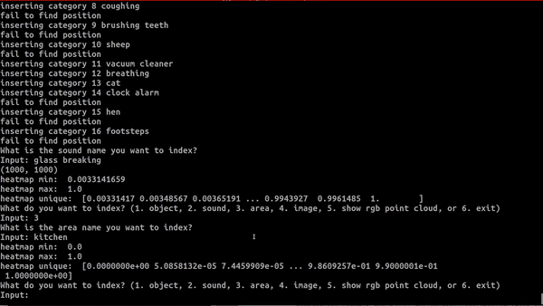

# AVLMaps
[](https://github.com/psf/black)
[](https://colab.research.google.com/drive/1gdtLvg_Fbl16N3ITp5FsU9ZAG6HmspVb?usp=sharing)
[](https://opensource.org/licenses/MIT)


[<b>Audio Visual Language Maps for Robot Navigation</b>](https://arxiv.org/pdf/2303.07522.pdf)

[Chenguang Huang](http://www2.informatik.uni-freiburg.de/~huang/), [Oier Mees](https://www.oiermees.com/), [Andy Zeng](https://andyzeng.github.io/), [Wolfram Burgard](http://www2.informatik.uni-freiburg.de/~burgard)

We present **AVLMAPs** (**A**udio **V**isual **L**anguage **Maps**), an open-vocabulary 3D map representation
for storing cross-modal information from audio, visual, and language
cues. When combined with large language models, AVLMaps consumes
multimodal prompts from audio, vision and language to solve zero-shot
spatial goal navigation by effectively leveraging complementary
information sources to disambiguate goals.



# Quick Start
Try AVLMaps creation and landmark indexing in [](https://colab.research.google.com/drive/1gdtLvg_Fbl16N3ITp5FsU9ZAG6HmspVb?usp=sharing).

## Setup Environment

To begin on your own machine, clone this repository locally
```bash
git clone https://github.com/avlmaps/AVLMaps.git
```
Install requirements:
```bash
$ conda create -n avlmaps python=3.8 -y  # or use virtualenv
$ conda activate avlmaps
$ conda install jupyter -y
$ cd AVLMaps
$ bash install.bash
```

## Download Checkpoints
You can download the [AudioCLIP](https://github.com/AndreyGuzhov/AudioCLIP) and [LSeg](https://github.com/isl-org/lang-seg) checkpoints with the following command:

```bash
bash download_checkpoints.bash
```


## Generate Dataset
To build AVLMaps for simulated environments, we manually collected RGB-D videos among 10 scenes in Habitat simulator with Matterport3D dataset. We provide script and pose meta data to generate the RGB-D videos. We also collect 20 sequences of RGB videos with poses for each scene and insert audios from ESC-50 dataset to create audio videos. Please follow the next few steps to generate the dataset.

### Download ESC50 dataset
We need to download the source ESC50 audio dataset with the following command. For more information, please check the official repo: [https://github.com/karolpiczak/ESC-50](https://github.com/karolpiczak/ESC-50).
```
wget https://github.com/karoldvl/ESC-50/archive/master.zip -P ~/
unzip ~/master.zip -d <target_dir>
```
The extracted ESC-50 dataset is under the directory `<target_dir>/ESC-50-master`. You need to modify the paths in `config/data_paths/default.yaml`:
  * set `esc50_meta_path` to `<target_dir>/ESC-50-master/meta/esc50.csv`
  * set `esc50_audio_dir` to `<target_dir>/ESC-50-master/audio`

### Download Matterpot3D dataset
Please check [Dataset Download](https://niessner.github.io/Matterport/), sign the [Terms of Use](http://kaldir.vc.in.tum.de/matterport/MP_TOS.pdf), and send to the responsible person to request the Matterport3D mesh for the use in Habitat simulator. The return email will attach a python script to download the data. Copy and paste the script to a file `~/download_mp.py`. Run the following to download the data:

```bash
cd ~
# download the data at the current directory
python2 download_mp.py -o . --task habitat
# unzip the data
unzip v1/tasks/mp3d_habitat.zip
# the data_dir is mp3d_habitat/mp3d
```
Modify the paths in `config/data_paths/default.yaml`:
* Change the `habitat_scene_dir` to the downloaded Matterport3D dataset `~/mp3d_habitat/mp3d`.
  <details>
    <summary>The structure of the <code>habitat_scene_dir</code> looks like this</summary>
    <pre><code>
      # the structure of the habitat_scene_dir looks like this
      habitat_scene_dir
        |-5LpN3gDmAk7
        |   |-5LpN3gDmAk7.glb
        |   |-5LpN3gDmAk7_semantic.ply
        |   |-...
        |-gTV8FGcVJC9
        |   |-gTV8FGcVJC9.glb
        |   |-gTV8FGcVJC9_semantic.ply
        |   |-...
        |-jh4fc5c5qoQ
        |   |-jh4fc5c5qoQ.glb
        |   |-jh4fc5c5qoQ_semantic.ply
        |   |-...
        ...
    </code></pre>
  </details>


### Download and Generate AVLMaps Dataset

<details>
  <summary>Configure the <code>config/generate_dataset.yaml</code></summary>
  
  * Change the value for `defaults/data_paths` in `config/generate_dataset.yaml` to `default`.
  * Change the `avlmaps_data_dir` to the where you want to download the dataset
  * Change `data_cfg.resolution.w` and `data_cfg.resolution.h` to adjust the resolution of the generated rgb, depth, and semantic images.
  * Change `rgb`, `depth`, and `semantic` to `true` to generate corresponding data, and to `false` to ignore corresponding data.
  * Change `camera_height` to change the height of camera relative to the robot base


</details>

Run the following command to download and generate the dataset. The generated dataset takes around 150GB disk space.

```bash
# go to <REPO_ROOT>/dataset of this repository
python dataset/generate_dataset.py
```
<details>
  <summary>After the data generation, the data structure will look like the following</summary>
  <pre><code>
# the structure of the avlmaps_data_dir will look like this
avlmaps_data_dir
├── 5LpN3gDmAk7_1
│   ├── poses.txt
│   ├── audio_video
│   │   ├── 000000
│   │   │   ├── meta.txt
│   │   │   ├── poses.txt
│   │   │   ├── output.mp4
│   │   │   ├── output_level_1.wav
│   │   │   ├── output_level_2.wav
│   │   │   ├── output_level_3.wav
│   │   │   ├── output_with_audio_level_1.mp4
│   │   │   ├── output_with_audio_level_2.mp4
│   │   │   ├── output_with_audio_level_3.mp4
│   │   │   ├── range_and_audio_meta_level_1.txt
│   │   │   ├── range_and_audio_meta_level_2.txt
│   │   │   ├── range_and_audio_meta_level_3.txt
│   │   │   ├── rgb
│   │   │   |   ├── 000000.png
│   │   │   |   ├── ...
│   │   ├── 000001
│   │   ├── ...
│   ├── depth
│   │   ├── 000000.npy
│   │   ├── ...
│   ├── rgb
│   │   ├── 000000.png
│   │   ├── ...
│   ├── semantic
│   │   ├── 000000.npy
│   │   ├── ...
├── gTV8FGcVJC9_1
│   ├── ...
├── jh4fc5c5qoQ_1
│   ├── ...
...
  </code></pre>

</details>

The details of the structure of data are explained in the dataset [README](./dataset/README.md).

## Create a AVLMap with the Generated Dataset
* Change the value for `defaults/data_paths` in `config/map_creation_cfg.yaml` to `default`.
* Change the `habitat_scene_dir` and `avlmaps_data_dir` in `config/data_paths/default.yaml` according to the steps in the **Generate Dataset** section above.
* Run the following command to build the VLMap
  ```bash
  cd application
  python create_map.py
  ```

### Config the Created AVLMap
* Change the scene you want to generate VLMap for by changing `scene_id` (0-9) in `config/map_creation_cfg.yaml`
* Customize the map by changing the parameters in `config/params/default.yaml`
  * Change the resolution of the map by changing `cs` (cell size in meter) and `gs` (grid size)
* Customize the camera pose and base pose by changing `config/vlmaps.yaml`. Change the `pose_info` section.
  * `pose_type` means the type of poses stored in `poses.txt` files. Currently we only support `mobile_base` which means the poses are the poses for the base. But you can implement `camera` if you want.
  * `camera_height` means the camera height relative to the base. Change it if you set different camera height when you generate the dataset.
  * `base2cam_rot` means the row-wise flattened rotation matrix from robot base to the camera coordinate frame (z forward, x right, y down).
  * `base_forward_axis`, `base_left_axis`, `base_up_axis`: your robot base coordinate. They mean what is the coordinate of the forward unit vector [1, 0, 0] projected into your robot base frame, the coordinate of the left unit vector [0, 1, 0] projected into your robot base frame, the coordinate of the upward unit vector [0, 0, 1] projected into your robot base frame.
* Other settings in `config/vlmaps.yaml`
  * `cam_calib_mat` is the flattened camera intrinsics matrix
  * `depth_sample_rate`: we only back project randomly sampled `h * w / depth_sample_rate` pixels at each frame

## Index a VLMap
* Change the value for `defaults/data_paths` in `config/map_indexing_cfg.yaml` to `default`.
* Change the `habitat_scene_dir` and `avlmaps_data_dir` in `config/data_paths/default.yaml` according to the steps in the **Generate Dataset** section above.
* Run the following command to index a VLMap you built
  ```bash
  cd application
  python index_map.py
  ```
  You will be asked to input a number to indicate what kind of indexing you want to perform.

  
  
  **Index Object**: input an object category name to generate the heatmap.

  

  **Index Sound**: you will see a top-down map showing GT positions of inserted sounds. Input a sound name to generate the heatmap.

  

  **Index Area**: input an area name like "kitchen", "bathroom" to generate the heatmap.

  

  **Index Image**: you will see a top-down map. Select two points on the map to get the image position and the pointing direction. Then you will see the selected pose on the top-down map and the query image at that pose. The heatmap for the query image is subsequently generated.

  

### Configure the Indexing
* Change the file `config/map_indexing_cfg.yaml`
  * `decay_rate`: set the heatmap decay rate. When it is smaller, the transition of the heat is clearer and covers larger area.
  * `image_query_cfg`: 
    * set the camera height with `camera_height`
    * set the image resolution with `resolution.w` and `resolution.h`
    * set `save_query_image` to True to save the selected query image in the interactive top-down map.


## Citation

If you find the dataset or code useful, please cite:

```bibtex
@inproceedings{huang23avlmaps,
              title={Audio Visual Language Maps for Robot Navigation},
              author={Chenguang Huang and Oier Mees and Andy Zeng and Wolfram Burgard},
              booktitle={Proceedings of the International Symposium on Experimental Robotics (ISER)},
              year={2023},
              address = {Chiang Mai, Thailand}
          }
```

## License

MIT License

## Acknowledgement

We extend our heartfelt gratitude to the authors of the projects listed below for generously sharing their code with the public, thus greatly facilitating our research on AVLMaps:

* [Hierarchical Localization](https://github.com/cvg/Hierarchical-Localization)
* [AudioCLIP](https://github.com/AndreyGuzhov/AudioCLIP)
* [ESC-50 Dataset for Environmental Sound Classification](https://github.com/karolpiczak/ESC-50)
* [Language-driven Semantic Segmentation (LSeg)](https://github.com/isl-org/lang-seg)
* [Visual Language Maps for Robot Navigation](https://github.com/vlmaps/vlmaps)

Your contribution is invaluable to our work, and we deeply appreciate your commitment to advancing the field.